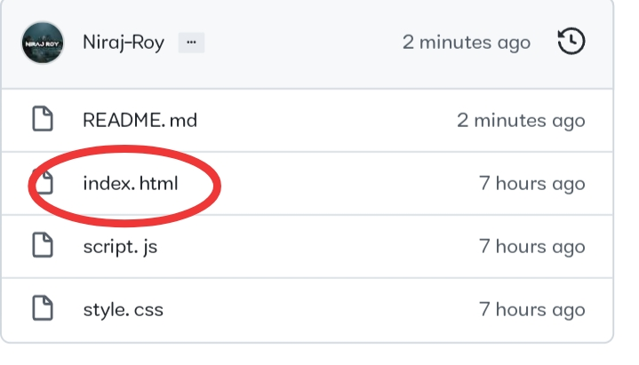
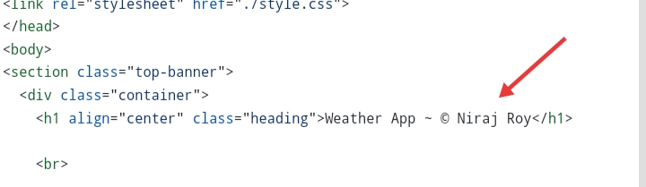
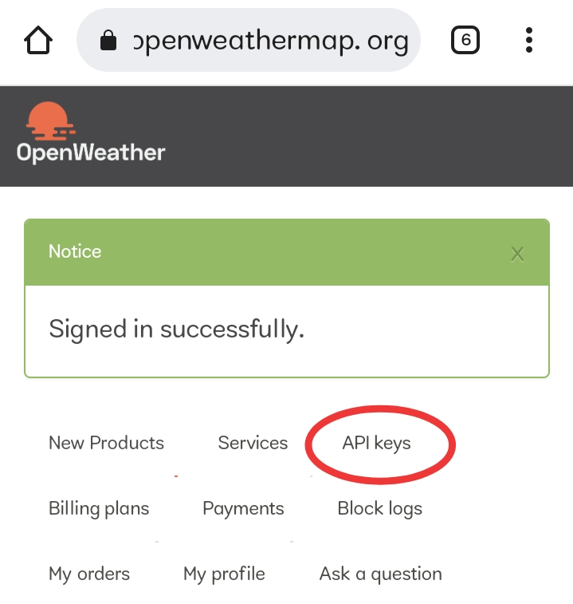
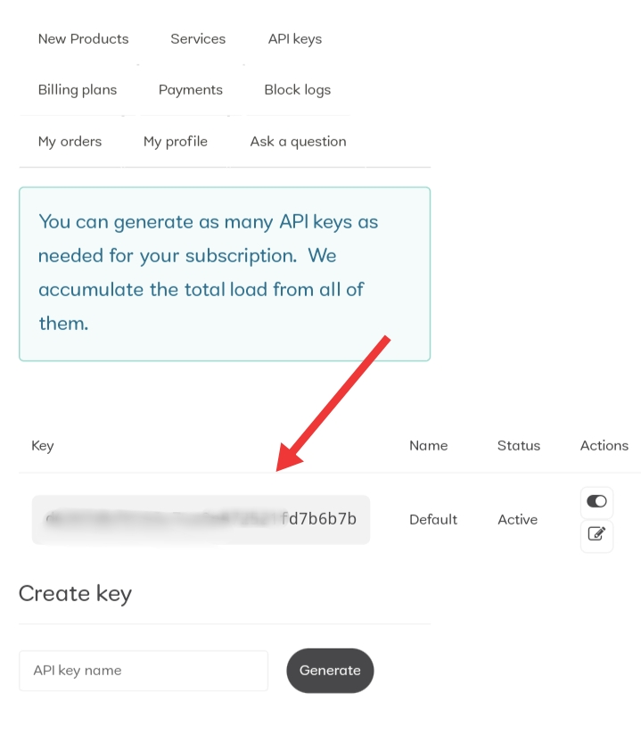
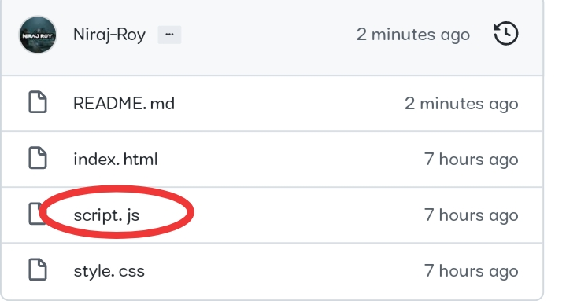
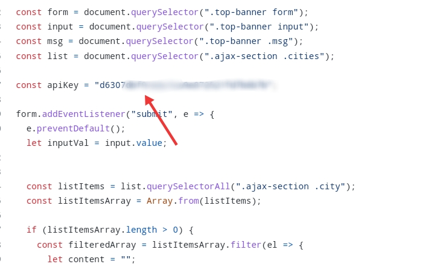

# 👉 [WeatherApp](https://mausam-batao.netlify.app/) 👈

#  PREVIEW

<h2>
Q. How to Make your Own WeatherApp ? </h2>

<h2> 

`STEP 1` - Fork the repository   

`STEP 2` - Go to your Index.html File  

  

`STEP 3` - Replace my name with urs 

  

`STEP 4` - Now you need an API key to do the weather forecasting...  `visit` https://openweathermap.org/ and sign up (u can also choose free plan there) 

`STEP 5` - Sign in there and click on API Keys

 

u will get ur API key from there !

`Final Step` - Go to script.js file 

 
 and replace API key with yours API and commit changes
  

And u are all done ...!!!

Now u can deploy / host these codes on NETLIFY,VERCEL,HEROKU or any other Platform to make ur website Live...

⚠️ DISCLAIMER ⚠️ - Use Your own API key... Using mine may not work becoz it has limits :)

<h3> U can mail me if u have any problem , I'll be happy to help u :)</h3>

     Happy Programming !!! 😊 Don't forget to Star the repository and Follow me if u liked the content 
